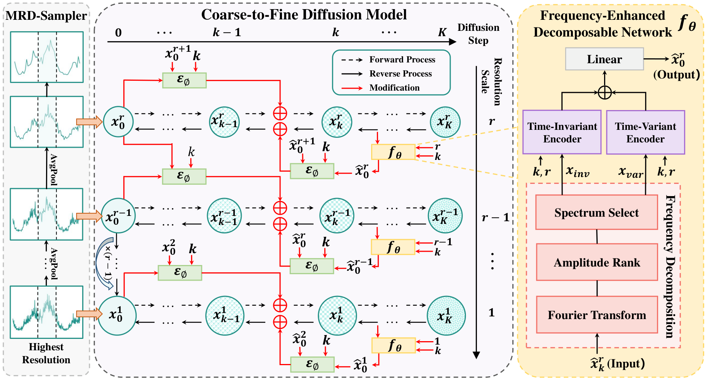

# MODEM

PyTorch implementation of **Multi-Resolution Decomposable Diffusion Model for Non-stationary Time Series Anomaly Detection** (ICLR 2025), with training, coarse-to-fine reconstruction, and ensemble anomaly detection.

[Paper](assets/MODEM.pdf) · [Framework PDF](assets/Framework.pdf)

## Abstract

Non-stationary time series exhibit changing statistical properties and temporal dependencies, making it difficult to distinguish normal variations from anomalies. MODEM addresses this challenge through multi-resolution modeling, combining a coarse-to-fine diffusion process with a frequency-enhanced decomposable network. Cross-resolution correlations guide the forward diffusion process, while reconstructed low-resolution signals guide the recovery of finer temporal details during reverse diffusion. The denoising network separates time-invariant and time-variant components in the frequency domain and processes them with dedicated encoders to capture shared patterns and evolving dynamics. Reconstruction errors across diffusion steps and resolution scales are combined through ensemble voting for anomaly detection.

## Framework



1. **Multi-resolution sampling.** Average pooling produces aligned series at different temporal resolutions, exposing both broad trends and local fluctuations.
2. **Coarse-to-fine diffusion.** A cross-attention prior incorporates correlations between adjacent resolutions into diffusion transitions. Reconstruction proceeds from coarse to fine, using recovered lower-resolution signals to guide DDIM sampling at higher resolutions.
3. **Frequency-enhanced decomposition.** STFT separates dominant time-invariant components from time-variant residuals. Hierarchical attention and dilated temporal convolution blocks encode these components to predict clean series.
4. **Anomaly detection.** Reconstruction errors from multiple resolutions and denoising steps are converted into anomaly votes and aggregated into pointwise predictions.

## Installation

Requires Python 3.11. Create an environment and install the dependencies:

```bash
python3.11 -m venv .venv
source .venv/bin/activate
pip install -r requirements.txt
```

For CUDA 12.1, install PyTorch first with `pip install torch==2.5.1 --index-url https://download.pytorch.org/whl/cu121`. Alternatively, run `bash scripts/setup.sh` with [uv](https://docs.astral.sh/uv/) installed.

## Data

Download SMD (`--entities all` downloads all machines):

```bash
python scripts/prepare_data.py --entities machine-1-1 --output data/Machine
```

For other datasets, provide `ENTITY_train.npy`, `ENTITY_test.npy`, and `ENTITY_test_label.npy` in one directory. Train/test arrays must have shape `[time, features]`. Labels must be a matching binary vector. Trusted `.pkl` files are also supported. Supply finite numeric values with the same features in both splits. SWaT must be obtained from its data provider.

## Usage

```bash
python run_pipeline.py --data-root data/Machine --entity machine-1-1 \
  --config configs/paper.yaml --output runs/machine-1-1 --device cuda:0
```

Use `--device cpu` for CPU execution. `--epochs`, `--batch-size`, and `--seed` override the configuration. The default runs training, checkpoint loading, reconstruction, and evaluation.

```bash
python run_pipeline.py --stage train --resume --output runs/machine-1-1 --epochs 100

python run_pipeline.py --stage infer --output runs/machine-1-1

python run_pipeline.py --stage evaluate --output runs/machine-1-1 --device cpu
```

For a different entity or data directory, pass the same `--entity` and `--data-root` when resuming or running inference. Outputs include checkpoints, reconstruction scores, predictions, raw/point-adjusted metrics, and a diagnostic plot.

## Citation

If you use MODEM in your research, please cite:

```bibtex
@inproceedings{zhong2025modem,
  title     = {Multi-Resolution Decomposable Diffusion Model for Non-stationary Time Series Anomaly Detection},
  author    = {Zhong, Guojin and Wang, Pan and Yuan, Jin and Li, Zhiyong and Chen, Long},
  booktitle = {The Thirteenth International Conference on Learning Representations},
  year      = {2025}
}
```

## Acknowledgements

We thank the authors of [ImDiffusion](https://github.com/17000cyh/IMDiffusion) and [CSDI](https://github.com/ermongroup/CSDI) for their reference codebases for diffusion-based time-series modeling and reconstruction. The time-variant encoder follows the ideas of [ModernTCN](https://github.com/luodhhh/ModernTCN). The SMD downloader uses data provided by [OmniAnomaly](https://github.com/NetManAIOps/OmniAnomaly).
